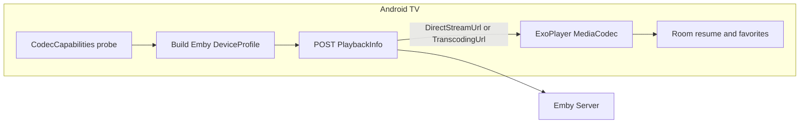

# Android TV player (Emby + SMB, native codecs)

## Cross-platform recommendation (Android first, tvOS later)

- **Do not rely on Flutter/React Native for the video stack** if you want predictable **MediaCodec / VideoToolbox** behavior and TV-remote polish. Video on those stacks still leans on platform views and adds integration risk.
- **Practical split for a future tvOS app:**
  - **Kotlin Multiplatform (KMP)** for *non-UI* modules: Emby REST models, device-profile builders (with `expect/actual` for codec enumeration), server config, favorites DTOs, and pure networking. This is where “share code” pays off.
  - **Native UI per platform:** [Jetpack Compose for TV](https://developer.android.com/jetpack/compose/tv) on Android; **SwiftUI** on tvOS later. Infuse-like UX is mostly UI + player integration; sharing UI across TV platforms is rarely worth the compromise.
- If you prefer **velocity over shared Kotlin**, ship **100% Android (Kotlin + Compose TV)** first and extract a KMP module only when you start tvOS—avoid upfront KMP ceremony unless the team already uses it.

**Verdict:** Android-native app now; **optional KMP** for Emby + profile logic when tvOS becomes real. “Flatter” applies to **layering** (thin UI, fat domain, clear interfaces), not necessarily one UI framework everywhere.

---

## License-safe playback (no bundled FFmpeg)

- Use **AndroidX Media3 ExoPlayer** with the **default decoder factory** (hardware **MediaCodec** path). **Do not** enable ExoPlayer’s **FFmpeg extension** or bundle **libav/ffmpeg**—those are the usual LGPL/GPL pain points.
- Subtitles: prefer **Emby-delivered** text/sidecar and ExoPlayer text rendering; avoid shipping ASS/SSA libraries with unclear licensing unless you audit them.
- Samba: prefer **Apache 2.0** SMB clients (e.g. **SMBJ** is commonly used; verify the exact artifact and license in your `NOTICE` file). Document third-party licenses in-repo for an open-source release.

---

## Decoding capability → Emby transcoding

Emby decides direct play vs transcode based on the client’s declared **DeviceProfile** when you call **`POST /Items/{Id}/PlaybackInfo`** ([Emby REST: postItemsByIdPlaybackinfo](https://dev.emby.media/reference/RestAPI/MediaInfoService/postItemsByIdPlaybackinfo.html)). The response exposes `PlayMethod`, `DirectStreamUrl`, `TranscodingUrl`, etc.

**Client-side pipeline:**

1. **Probe Android decoders** with [`MediaCodecList`](https://developer.android.com/reference/android/media/MediaCodecList) / [`CodecCapabilities`](https://developer.android.com/reference/android/media/MediaCodecInfo.CodecCapabilities) for relevant MIME types (e.g. `video/avc`, `video/hevc`, `video/av01`, audio AAC/AC-3/E-AC-3 where exposed and licensed on the device).
2. **Map** supported MIME types, profile/level (where available), max resolution, and HDR caps into Emby’s **DirectPlayProfiles**, **CodecProfiles**, and **TranscodingProfiles** (mirror patterns from Emby/Jellyfin official clients conceptually—same API contract).
3. **Request playback** with `EnableTranscoding: true` so the server can fall back when the file exceeds what you declared.
4. **Optional safety net:** if local playback fails at runtime (rare mismatch), re-request `PlaybackInfo` with stricter limits or force transcode for that session.

Reporting progress to the server uses **`/Sessions/Playing`**, **`/Sessions/Playing/Progress`**, **`/Sessions/Playing/Stopped`** ([Playback check-ins](https://dev.emby.media/doc/restapi/Playback-Check-ins.html)) so dashboards and resume stay consistent.

---

## Feature mapping to your specs

| Requirement | Approach |
|-------------|----------|
| Open source | Apache-2.0 or MIT license, `NOTICE` for deps, CI for build |
| Playback speed 1.25 / 1.5 / 2.0 | ExoPlayer `PlaybackParameters` ([setPlaybackSpeed](https://developer.android.com/reference/androidx/media3/common/Player)) |
| Progress memory | **Room** table: `itemId`, `serverId`, `positionMs`, `updatedAt`; sync with Emby progress APIs where appropriate |
| Emby multi-server | Room **ServerAccount** entities; base URL, user, token/API key; per-server active session |
| Posters from Emby | Use image tags from `BaseItemDto` / `ImageTags` and Emby image endpoints (cache with Coil or similar) |
| Subtitles from Emby | Select subtitle stream index in `PlaybackInfo`; fetch text tracks per Emby rules; ExoPlayer `TextOutput` / subtitle APIs |
| TV remote friendly | Compose TV **focus** and **D-pad** navigation; overlay controls with timeout; clear “back” behavior |
| SMB | Separate “library source” type: SMB connection settings + file browser; stream via **progressive** readers into ExoPlayer `DataSource` (or HTTP if you add a tiny local proxy—tradeoffs in implementation) |
| Local favorites | Room table keyed by `(serverId, itemId)`; expose in home row |

---

## Suggested module layout (monorepo)

- **`app`** – Compose TV UI, navigation, settings, player screen.
- **`player`** – Media3 setup, track selection, speed, subtitle attachment, error → retry with transcode.
- **`emby-api`** – Retrofit/Ktor client, auth, PlaybackInfo, items, images, sessions—DTOs match OpenAPI/Swagger.
- **`device-profile`** – Codec probe → `DeviceProfile` (this is the natural **KMP candidate** if you add `expect/actual` later).
- **`storage`** – Room, datastore for preferences.
- **`smb`** (optional second phase) – SMB browsing + streaming adapters.

---

## Implementation phases

**Phase 1 – Playback core (Emby-only streaming)**  
Auth, server list, library browse, item details with poster, `PlaybackInfo` integration, ExoPlayer playback, playback reporting, resume row.

**Phase 2 – TV UX + polish**  
Focus, thumbnails rows, chapters if exposed, audio/subtitle switching, speed control overlay, parental controls if needed.

**Phase 3 – SMB**  
Connection manager, browse, integrate with same player `DataSource` abstraction.

**Phase 4 (optional) – KMP extraction**  
Move `emby-api` DTOs + `device-profile` to `commonMain`; keep Android UI and player in `androidMain`.

---

## Risks and decisions to document in README

- **Codec support varies by OEM** (Dolby, DTS, AC-3)—your DeviceProfile must reflect actual decoders, not a static list.
- **SMB on TV** can be CPU/network heavy; consider **direct play from Emby** when the file is already on NAS Emby indexes, and SMB only for “dumb” shares.
- **DASH/HLS transcodes** from Emby: ExoPlayer handles these well; validate against your server’s `TranscodingSubProtocol`.

---

## Repository / compliance checklist (open source)

- `LICENSE`, `NOTICE`, CONTRIBUTING, security disclosure.
- No proprietary codecs bundled; honor Google Play codec / DRM notes if you add Widevine later (out of scope unless you need it).
