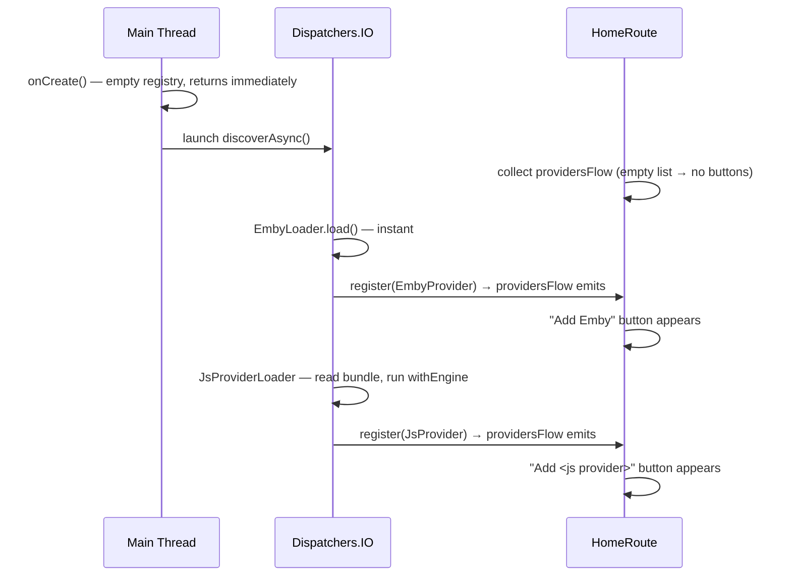

# Async Provider Loading

Six files change across three modules. The `OpenTuneProvider` interface is untouched — `getFieldsSpec()` and `providesCover` remain plain synchronous members because a provider is only ever registered *after* its metadata is already computed.

## Flow after this change



---

## 1. `:contracts` — `OpenTuneProviderLoader`

**File:** [`contracts/src/main/java/com/opentune/provider/ProviderContracts.kt`](contracts/src/main/java/com/opentune/provider/ProviderContracts.kt)

Change `load` to `suspend fun`:

```kotlin
interface OpenTuneProviderLoader {
    suspend fun load(register: (OpenTuneProvider) -> Unit)
}
```

---

## 2. `OpenTuneProviderRegistry` — reactive registry

**File:** [`app/src/main/java/com/opentune/app/providers/OpenTuneProviderRegistry.kt`](app/src/main/java/com/opentune/app/providers/OpenTuneProviderRegistry.kt)

Add a `StateFlow` and a suspend `discoverAsync`. The synchronous `discover()` and `allProviders()` are removed.

```kotlin
class OpenTuneProviderRegistry {
    private val _providers = MutableStateFlow<List<OpenTuneProvider>>(emptyList())
    val providersFlow: StateFlow<List<OpenTuneProvider>> = _providers.asStateFlow()

    @Synchronized
    fun register(provider: OpenTuneProvider) {
        _providers.update { it + provider }
        providersById[provider.protocol] = provider
    }

    suspend fun discoverAsync() = coroutineScope {
        ServiceLoader
            .load(OpenTuneProviderLoader::class.java, ...)
            .forEach { loader -> launch(Dispatchers.IO) { loader.load(::register) } }
    }
    // provider(protocol) and platformCapabilities remain unchanged
}
```

---

## 3. `OpenTuneApplication.onCreate()` — fire and forget

**File:** [`app/src/main/java/com/opentune/app/OpenTuneApplication.kt`](app/src/main/java/com/opentune/app/OpenTuneApplication.kt)

Add an app-level scope. Replace `discover()` with a background launch.

```kotlin
val appScope = CoroutineScope(SupervisorJob() + Dispatchers.Main.immediate)

override fun onCreate() {
    // ... existing init ...
    providerRegistry = OpenTuneProviderRegistry()
    appScope.launch { providerRegistry.discoverAsync() }   // returns immediately
    // providerRegistry.setCapabilities(...) still called here — safe, it's a field write
}
```

---

## 4. `JsProvider` — suspend factory, pre-computed fields

**File:** [`providers/js/src/main/java/com/opentune/provider/js/JsProvider.kt`](providers/js/src/main/java/com/opentune/provider/js/JsProvider.kt)

Remove the `init {}` `runWithEngine` block. Accept pre-computed values in the constructor. Add a `suspend fun create()` companion that runs `withEngine` (already exists as a suspend helper) instead of `runWithEngine` (which uses `runBlocking`).

```kotlin
class JsProvider private constructor(
    private val assetPath: String,
    private val jsBundle: String,
    private val hostApis: HostApis,
    override val providesCover: Boolean,
    private val cachedFieldsSpec: List<ServerFieldSpec>,
) : OpenTuneProvider {

    override fun getFieldsSpec() = cachedFieldsSpec

    companion object {
        suspend fun create(assetPath: String, jsBundle: String, hostApis: HostApis): JsProvider {
            var providesCover = false
            var fieldsSpec: List<ServerFieldSpec> = emptyList()
            withEngine(hostApis, jsBundle) { engine ->
                providesCover = engine.evalExpression(
                    "globalThis.opentuneProvider.providesCover") == "true"
                val result = engine.callMethod("getFieldsSpec", "{}") ?: ""
                fieldsSpec = parseFieldsSpec(result)
            }
            return JsProvider(assetPath, jsBundle, hostApis, providesCover, fieldsSpec)
        }
    }
}
```

`withEngine` already exists as a private `suspend fun` in `JsProvider` — it creates a temporary engine, evaluates the bundle, runs the block, and closes. It replaces `runWithEngine` (the `runBlocking` wrapper) at this call site.

---

## 5. `JsProviderLoader` — becomes suspend

**File:** [`providers/js/src/main/java/com/opentune/provider/js/JsProviderLoader.kt`](providers/js/src/main/java/com/opentune/provider/js/JsProviderLoader.kt)

```kotlin
class JsProviderLoader : OpenTuneProviderLoader {
    override suspend fun load(register: (OpenTuneProvider) -> Unit) {
        val assets = AssetManagerHolder.get()
        val hostApis = HostApis()
        assets.list("")
            ?.filter { it.endsWith(".js") }
            ?.forEach { bundleFile ->
                val bundle = withContext(Dispatchers.IO) {
                    assets.open(bundleFile).use { it.readBytes().toString(Charsets.UTF_8) }
                }
                val provider = JsProvider.create(bundleFile, bundle, hostApis)
                register(provider)   // emits into providersFlow immediately
            }
    }
}
```

Each `.js` file registers as soon as it is ready. With multiple files they could be parallelised further with `coroutineScope { forEach { launch { ... } } }`.

---

## 6. Emby and SMB loaders — add `suspend` modifier

**Files:** [`providers/emby/.../EmbyProvider.kt`](providers/emby/src/main/java/com/opentune/emby/EmbyProvider.kt) and [`providers/smb/.../SmbProvider.kt`](providers/smb/src/main/java/com/opentune/smb/SmbProvider.kt) (whichever class implements `OpenTuneProviderLoader`)

Add `suspend` to the `load` override. Body is unchanged — these are instant `register(...)` calls.

---

## 7. `HomeRoute` — collect `StateFlow`

**File:** [`app/src/main/java/com/opentune/app/ui/home/HomeRoute.kt`](app/src/main/java/com/opentune/app/ui/home/HomeRoute.kt)

Replace the frozen `remember` with a collected flow:

```kotlin
// Before:
val providers = remember { app.providerRegistry.allProviders().toList() }

// After:
val providers by app.providerRegistry.providersFlow.collectAsState()
```

The `LaunchedEffect` that observes `serversByType` already iterates `providers` — it will naturally pick up newly registered providers as the list grows because `providers` is now reactive.

---

## What does NOT change

- `OpenTuneProvider` interface — `getFieldsSpec()` and `providesCover` stay synchronous plain members
- `ServerAddRoute` / `ServerEditRoute` — `remember { provider.getFieldsSpec() }` stays; by the time a user navigates to add/edit, the provider is fully registered and the call is an instant field read
- `CoverExtractor` — `provider.providesCover` stays a plain property read
- `ServerConfigRepository.loadEditFields` — already on `Dispatchers.IO`, no change needed
