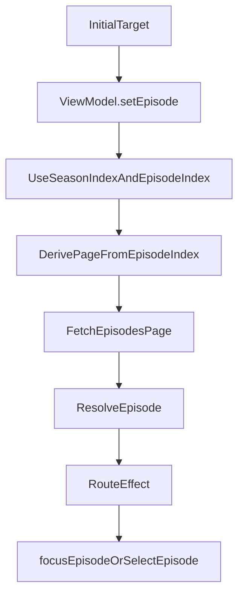

# Finish Series Episode Flow

## Direction Learned

Your draft is pointing toward an index-based model:

- Treat top-level children as `subEntries` for reusable detail child loading.
- For series, `SeriesDetailRoute` interprets `subEntries` as seasons.
- For series, use index state: season index plus absolute episode index within that season.
- Do not store page index as state; derive it from `episodeIndex / EPISODES_PAGE_SIZE`.
- Let `DetailViewModel` compute which season/page/episode should be loaded from a target like saved progress or next episode.
- Let `SeriesDetailRoute` react to the resolved `EntryInfo` and call `focusEpisode()` / `selectEpisode()` for side effects.

Current draft is not compile-ready yet because some names/types drifted: `subEntryIndex` is declared `Int` but used like `String?`, `seasons`/`digipakChildren` are still referenced but removed, `loadEntries(val lvl...)` is invalid Kotlin, and the route has an undefined `episode` in the resolver effect.

## Plan

1. Restore a clear ViewModel state model in [`content/ui/src/main/java/com/opentune/content/ui/catalog/detail/DetailViewModel.kt`](content/ui/src/main/java/com/opentune/content/ui/catalog/detail/DetailViewModel.kt).

Use generic child-entry state in the ViewModel so the route owns content-type meaning:

- `subEntries: StateFlow<List<EntryInfo>>`
- `subEntryIndex: StateFlow<Int>` for the selected top-level child index
- `episodes: StateFlow<List<EntryInfo>>`
- `episodeIndex: StateFlow<Int>` as the absolute index within the selected season
- `episodePage` should be derived where needed, not stored

For series, `subEntryIndex` means selected season index. For digipak, it can mean selected child index if/when the digipak route adopts the generic state. Keep `singleChild` support as needed for the current digipak single-child UI.

2. Replace the old pending flags with one series target.

Add a small internal target model near `DetailViewModel`, or in a tiny sibling file if it stays clean:

```kotlin
sealed interface SeriesEpisodeTarget {
    val autoPlay: Boolean
    data class Progress(val seasonNumber: Int, val episodeNumber: Int, override val autoPlay: Boolean = false) : SeriesEpisodeTarget
    data class EpisodeIndex(val seasonIndex: Int, val episodeIndex: Int, override val autoPlay: Boolean = false) : SeriesEpisodeTarget
    data object First : SeriesEpisodeTarget { override val autoPlay = false }
}
```

This keeps the “which episode should we play/focus?” decision as data, not scattered `remember` variables.

3. Make `loadEpisodes(target)` own season/page derivation.

In [`DetailViewModel.kt`](content/ui/src/main/java/com/opentune/content/ui/catalog/detail/DetailViewModel.kt):

- `loadEntries()` fetches `subEntries` only; for series, those are seasons.
- `setEpisode(seasonIndex, episodeIndex, autoPlay = false)` becomes the single public series selection API.
- `setEpisode(...)` waits for `subEntries` if necessary, derives `pageIndex = episodeIndex / EPISODES_PAGE_SIZE`, fetches that page from `subEntries[seasonIndex].id`, then resolves the pending episode.
- Remove `focusedChildEntryId`; focus derives from `episodeIndex` and the currently loaded page.
- Remove `setSeason()`, `selectSeason(...)`, `selectEpisodePage(...)`, and `selectSeasonAndPageForProgress`.
- Season selector clicks call `setEpisode(seasonIndex = clickedIndex, episodeIndex = 0)`.
- Pager clicks translate the page into an absolute episode index: for page `50–99`, call `setEpisode(currentSeasonIndex, episodeIndex = 50)`.
- Remove `selectSeasonAndPageForProgress`.

The invariant should be:

```kotlin
val pageIndex = episodeIndex / EPISODES_PAGE_SIZE
val indexWithinPage = episodeIndex % EPISODES_PAGE_SIZE
```

Only `episodeIndex` is source-of-truth state.

For focus, the loaded page should receive `indexWithinPage` rather than an entry id. `EpisodeRow` should focus the item at that index when the page changes or the index changes.

The core flow should become:



4. Simplify [`SeriesDetailRoute.kt`](content/ui/src/main/java/com/opentune/content/ui/catalog/detail/SeriesDetailRoute.kt).

Remove:

- `pendingAutoPlay`
- `pendingSeasonNumber`
- `pendingEpisodeNumber`
- direct episode focus-id mutation inside effects

Keep only route side effects:

- initialize player context
- call `viewModel.loadEntries()` to load subentries
- convert saved progress or UI actions into `setEpisode(seasonIndex, episodeIndex)`
- collect/consume resolved episode and call `focusEpisode()` or `selectEpisode()`
- register `setNextVideoCallback`

Important: the resolved episode path must call `focusEpisode()` for non-autoplay so `sharedVm.cache(...)`, focused id, and `playerController.prepare(...)` stay consistent.
`focusEpisode()` should update the ViewModel through `setEpisode(seasonIndex, episodeIndex)` rather than storing a focused entry id.

5. Fix next-video behavior through the same path.

In `setNextVideoCallback`:

- If the next episode is already in the loaded page, call `selectEpisode(nextEpisode)` directly.
- If the next episode is on the next page, call `viewModel.setEpisode(currentSeasonIndex, nextEpisodeIndex, autoPlay = true)`.
- If the next episode is in the next season, call `viewModel.setEpisode(nextSeasonIndex, episodeIndex = 0, autoPlay = true)`.

This removes the extra route flag and fixes page-boundary auto-advance.

6. Restore `SeriesOverviewScreen` API names and keep components local.

In [`SeriesOverviewScreen.kt`](content/ui/src/main/java/com/opentune/content/ui/catalog/detail/SeriesOverviewScreen.kt):

- Rename `pageIndexr` back to `EpisodePager`.
- Use stable, Kotlin-style parameter names (`seasonIndex`, `episodeIndex`, and derived `episodePage` only as a render value if needed).
- `onSelectSeason` should pass an index rather than an id, or the route should convert id to index before calling `setEpisode`.
- `onSelectPage` remains page-based visually but the route converts page to `episodeIndex = page * EPISODES_PAGE_SIZE`.
- `EpisodeRow` should take a focus index within the current page, not `initialFocusId`.
- `onFocusEpisode` should provide enough context for the route to call `setEpisode(currentSeasonIndex, absoluteEpisodeIndex)`, either by passing the row index or by letting the route compute it from `pageIndex`.
- Keep `SeasonSelector`, `EpisodeRow`, and `EpisodePager` private in this file as agreed.

7. Verify compile fallout.

Run a targeted compile after edits:

```shell
./gradlew :content:ui:compileDebugKotlin
```

If KSP cache fails again before Kotlin compilation, note that separately and run the smallest feasible check available, but first fix any IDE lints in the touched files.