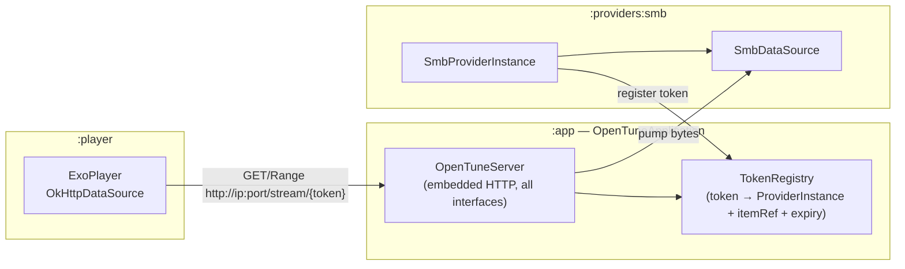

# OpenTune embedded web server

## Vision

Start a real HTTP server in `OpenTuneApplication` — analogous to a browser Service Worker that intercepts `fetch()` calls, but process-wide and accessible over LAN. Every resource (SMB video, cover art, subtitle sidecar, eventual remote upload) becomes a plain `http://` URL. The player, cover extractor, and subtitle controller all stop knowing about SMB; they just load URLs.




## Server design (in `:app`)

### Lifecycle

- Started in `OpenTuneApplication.onCreate()`, stopped on process termination.  
- Bind to `0.0.0.0` (all interfaces) on an **ephemeral port** chosen at startup; expose `val port: Int` and `val localIp: String` for use by the rest of the app.

### Auth

- **Every endpoint requires a short-lived bearer token** (a random 128-bit hex string) passed as part of the URL path or as a query param.  
- Tokens are registered in-memory in `TokenRegistry` and **revoked explicitly** (on playback dispose, on cover extractor done) or by a **TTL** (e.g. 30 s for cover/subtitle, unlimited-but-revocable for active playback).  
- This applies equally to loopback and LAN clients; the server does not distinguish origin.

### Routes (initial set)

- `GET /stream/{token}` — proxy an arbitrary byte range from any registered provider stream. Supports `Range` → `206 Partial Content`. Pump via provider's stream mechanism (see below).
- `GET /cover/{token}` — full-file response for cover extraction; short TTL token.
- `GET /subtitle/{token}` — full-file response for sidecar subtitle; tokens live for playback duration.
- `POST /upload` — *placeholder for remote upload feature; auth model TBD.*

### Library choice

- Add a **maintained, pure-JVM/Android embedded HTTP library** to `[gradle/libs.versions.toml](gradle/libs.versions.toml)` and `:app`'s `build.gradle.kts`. Candidates: **Ktor (`ktor-server-netty` or `ktor-server-cio`)**, which is already Kotlin-idiomatic and coroutine-native. Confirm binary size impact before committing.

## Provider contract change

### Replace `withStream` / `ItemStream`

Remove from `[ProviderContracts.kt](contracts/src/main/java/com/opentune/provider/ProviderContracts.kt)`:

- `interface ItemStream`
- `suspend fun <T> withStream(...): T? = null` on `OpenTuneProviderInstance`

Add:

```kotlin
// Returned by OpenTuneProviderInstance.openStream — nullable (default null = not supported).
// Callers must call close() when done.
interface ProviderStream {
    suspend fun getSize(): Long
    suspend fun readAt(position: Long, buffer: ByteArray, offset: Int, size: Int): Int
    fun close()
}

// Default impl returns null (Emby, JS providers unchanged).
suspend fun openStream(itemRef: String): ProviderStream? = null
```

`openStream` is used **exclusively** by the server's stream handler, not by player or UI code directly. This keeps the interface minimal.

### Remove `customMediaSourceFactory`

Remove from `[PlaybackContracts.kt](contracts/src/main/java/com/opentune/provider/PlaybackContracts.kt)`:

```kotlin
val customMediaSourceFactory: (() -> Any)? = null  // DELETE
```

`PlaybackSpec.url` is always non-null after this change. Simplify `[PlaybackSpecExt.toMediaSource](player/src/main/java/com/opentune/player/PlaybackSpecExt.kt)` to URL-only.

## SMB refactor

### `SmbProviderInstance` changes

- `openStream(itemRef)` → opens `DiskShare`, wraps in a `ProviderStream` impl (the renamed `SmbItemStream`, now `Closeable`).
- `getPlaybackSpec` → calls `app.openTuneServer.registerStream(instance, itemRef)` → gets back a URL like `http://192.168.x.x:PORT/stream/{token}`. Sets this as `url`, sets `customMediaSourceFactory = null` (then removed), keeps `SmbPlaybackHooks` with `onDispose` revoking the token.
- **No more** `ProgressiveMediaSource.Factory`, `MediaItem.fromUri("https://local.invalid/video")`, `DataSource.Factory` in `getPlaybackSpec`.
- **Subtitle sidecars** → register a per-subtitle token via `registerStream`; set `SubtitleTrack.externalRef = "http://..."`. Delete `downloadSubtitleToCache` and `subtitleCacheDir` from `SmbProviderInstance`. The `SubtitleController` already handles external HTTP refs without SMB knowledge.
- `SmbDataSource` is **kept** — it is still used by the server's stream handler to service `Range` requests efficiently. The read-ahead logic stays intact.

### What gets deleted from `:providers:smb`

- `subtitleCacheDir` parameter and all usage
- `downloadSubtitleToCache` method
- `SmbItemStream` private class (replaced by `ProviderStream` impl)

## App-layer cleanup

- `[CoverExtractor](app/src/main/java/com/opentune/app/ui/catalog/CoverExtractor.kt)`: register a short-TTL cover token for each item, call `MediaMetadataRetriever.setDataSource(url, headers)`, revoke token in `finally`. Delete `[ItemStreamMediaDataSource.kt](app/src/main/java/com/opentune/app/ui/catalog/ItemStreamMediaDataSource.kt)`.
- `[OpenTuneApplication](app/src/main/java/com/opentune/app/OpenTuneApplication.kt)`: start `OpenTuneServer`, expose `val openTuneServer: OpenTuneServer`.
- Providers access the server via a reference passed at instance creation or via a context-style injection (TBD; keep it simple — passing `OpenTuneServer` into `SmbProviderInstance` constructor is fine).

## Risks / validation priorities

- `**MediaMetadataRetriever.setDataSource(String, Map)` on Android TV:** must test on real hardware; some versions handle only `http://localhost` or reject non-HTTPS. Have a fallback plan (MMR → `setDataSource(FileDescriptor)` via a `ParcelFileDescriptor` pipe if loopback fails).
- **LAN auth is mandatory:** without token auth, any device on the same network can stream any SMB file. Tokens mitigate this but are only as strong as their entropy and TTL.
- **Port firewall / VPN:** on some Android TV builds, firewall rules or VPN apps may block inbound connections to ephemeral ports even from the same device; test loopback path as well as LAN.
- **Process kill / port reuse:** if the app is killed and restarted, the ephemeral port may change; any cached URLs become invalid. Tokens should encode enough to detect this (e.g. include a session nonce).

