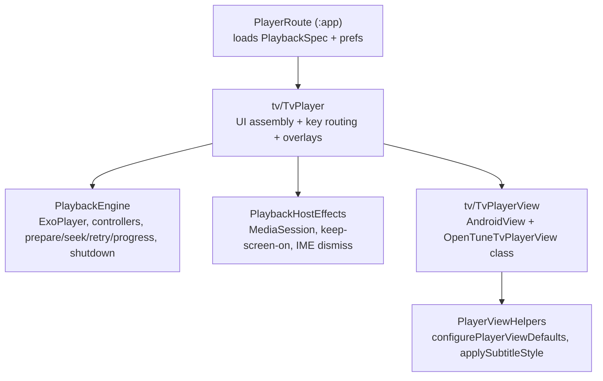
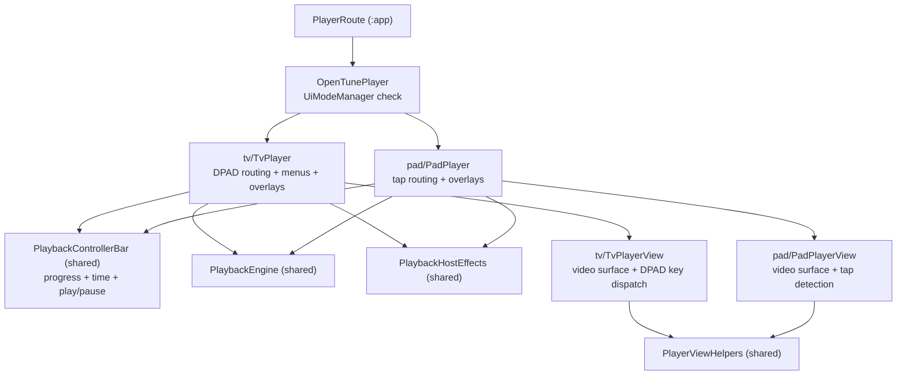

# Player Module — Phase 1 Refactor

## Goals

- Cut [player/src/main/java/com/opentune/player/OpenTunePlayerScreen.kt](player/src/main/java/com/opentune/player/OpenTunePlayerScreen.kt) (~430 lines) down to a thin shell (~40 lines) by extracting all non-presentation logic.
- Make the TV-only nature of every file explicit by moving TV code under a `tv/` subpackage.
- Pair each platform's `AndroidView` Composable with its `PlayerView` subclass in one file (no more "shared wrapper that always casts to TV").
- Zero behavior change. No new public API for `:app`. No controller refactors. No Pad code.

## Out of scope (deferred to Phase 2, when Pad starts)

- Moving `menuEntry` off `SubtitleController` / `AudioController` / `SpeedController`.
- Splitting `InfoOsd` / `AdjustOsd` into data + per-platform render.
- Introducing an `OpenTunePlayer` platform selector.
- Any `pad/` code.

## Target file layout

```
player/src/main/java/com/opentune/player/
  PlaybackEngine.kt          NEW — pure playback logic, no UI assembly
  PlaybackHostEffects.kt     NEW — MediaSession, keep-screen-on, IME dismiss
  PlayerViewHelpers.kt       NEW — configurePlayerViewDefaults, applySubtitleStyle
  OpenTuneExoPlayer.kt       unchanged
  RetryableMediaCodecSelector.kt  unchanged
  OpenTuneRenderersFactory.kt     unchanged
  PlaybackSpecExt.kt              unchanged
  InfoOsd.kt                      unchanged (still consumed only by TvPlayer)
  MbpsOverlay.kt                  unchanged
  subtitle/SubtitleController.kt  unchanged
  subtitle/SubtitleTrackLabels.kt unchanged
  audio/AudioController.kt        unchanged
  speed/SpeedController.kt        unchanged
  menu/PlayerMenu.kt              unchanged
  tv/
    TvPlayer.kt              NEW — replaces OpenTunePlayerScreen.kt
    TvPlayerView.kt          NEW — merges OpenTunePlayerView + OpenTuneTvPlayerView class

(deleted)
  OpenTunePlayerScreen.kt
  OpenTunePlayerView.kt
  OpenTuneTvPlayerView.kt
```

## Architecture after Phase 1



## Key design decisions

### `PlaybackEngine` is a class, not a `ViewModel`

```kotlin
class PlaybackEngine internal constructor(
    val exo: ExoPlayer,
    val subtitleCtrl: SubtitleController,
    val audioCtrl: AudioController,
    val speedCtrl: SpeedController,
    val trackInfo: State<TrackInfo>,        // videoMime/audioMime/decoderNames
    val bandwidthMbps: State<Float>,
) {
    suspend fun release()  // idempotent, replaces the AtomicBoolean-gated shutdown()
}

@Composable
fun rememberPlaybackEngine(
    spec: PlaybackSpec,
    startMs: Long,
    mediaStateStore: UserMediaStateStore,
    mediaStateKey: MediaStateKey,
    appConfigStore: AppConfigStore?,
    initialSubtitleTrackId: String?,
    initialAudioTrackId: String?,
    initialSubtitleOffsetFraction: Float,
    initialSubtitleSizeScale: Float,
): PlaybackEngine
```

Rationale (from earlier discussion): `ViewModel` would survive config changes you actively do not want to survive — `preBufferMs` change must rebuild the `ExoPlayer`. Stay with `remember(instanceKey, preBufferMs)` lifecycle exactly as today.

`rememberPlaybackEngine` internally owns, with the same keys as today:

- `OpenTuneExoPlayer.createForBundledSources(...)` (currently lines 184–190 of [OpenTunePlayerScreen.kt](player/src/main/java/com/opentune/player/OpenTunePlayerScreen.kt))
- `RetryableMediaCodecSelector`
- `AtomicBoolean released`
- The four big effects: prepare/seek/wait-READY (lines 268–373), speed-listener `DisposableEffect` (376–385), decoder-retry `DisposableEffect` (387–480), progress tick loop (486–511)
- `rememberSubtitleController` / `rememberAudioController` / `rememberSpeedController`
- The `onDispose { runBlocking { release() } }` block

### `release()` replaces `shutdown(userInitiated)`

Engine has no business knowing about navigation. Today's `shutdown(userInitiated: Boolean)` couples release with `onExit()`. After refactor:

- Engine: `suspend fun release()` — idempotent, persists position, calls `hooks.onStop` + `hooks.onDispose`, releases `ExoPlayer`.
- `TvPlayer` does the navigation:

```kotlin
val onBackOrExit = {
  scope.launch { engine.release(); onExit() }
}
```

`onDispose` still calls `runBlocking { engine.release() }` — idempotency makes the double-call safe.

### `PlaybackHostEffects` owns only truly shared concerns

```kotlin
@Composable
fun PlaybackHostEffects(exo: ExoPlayer)
```

Internally:
- `MediaSession.Builder(activity, exo).build()` + dispose (currently lines 528–541)
- `FLAG_KEEP_SCREEN_ON` add/clear
- IME dismiss `LaunchedEffect(Unit)` (currently lines 214–218)

The **controller hide timer** (lines 545–550) stays in `TvPlayer` for Phase 1 — its callee is `playerViewRef?.hideController()`. Phase 2 replaces this with `controllerVisible` Compose state and removes `hideController()` entirely.

### `tv/TvPlayerView.kt` — merged Composable + View class

Single file contains:

1. `class OpenTuneTvPlayerView : PlayerView` — moved as-is from current [OpenTuneTvPlayerView.kt](player/src/main/java/com/opentune/player/OpenTuneTvPlayerView.kt), package becomes `com.opentune.player.tv`.
2. `@Composable fun TvPlayerView(...)` — renamed from current `OpenTunePlayerView`, no longer needs the `as? OpenTuneTvPlayerView` cast because the inflated XML always returns one.

Shared bits extracted to `PlayerViewHelpers.kt`:

```kotlin
internal fun configurePlayerViewDefaults(view: PlayerView) {
    view.setShowBuffering(PlayerView.SHOW_BUFFERING_WHEN_PLAYING)
    view.setControllerHideOnTouch(false)
    view.setControllerAutoShow(false)
    view.setShowPreviousButton(false)
    view.setShowNextButton(false)
    view.setShowRewindButton(false)
    view.setShowFastForwardButton(false)
    view.setShowShuffleButton(false)
    view.setShowVrButton(false)
    view.setRepeatToggleModes(RepeatModeUtil.REPEAT_TOGGLE_MODE_NONE)
    view.setControllerShowTimeoutMs(-1)
}

internal fun applySubtitleStyle(view: PlayerView, translationYPx: Float, sizeScale: Float)
```

### XML reference must follow the class move

[player/src/main/res/layout/opentune_player_view.xml](player/src/main/res/layout/opentune_player_view.xml) line 2 currently says `<com.opentune.player.OpenTuneTvPlayerView>`. After moving the class to the `tv` subpackage, update to `<com.opentune.player.tv.OpenTuneTvPlayerView>`. This is the only XML touch.

### `TvPlayer` after refactor (~40 lines)

```kotlin
@OptIn(ExperimentalTvMaterial3Api::class, UnstableApi::class)
@Composable
fun TvPlayer(
    spec: PlaybackSpec,
    startMs: Long,
    mediaStateStore: UserMediaStateStore,
    mediaStateKey: MediaStateKey,
    appConfigStore: AppConfigStore?,
    initialSubtitleTrackId: String?,
    initialAudioTrackId: String?,
    initialSubtitleOffsetFraction: Float,
    initialSubtitleSizeScale: Float,
    onExit: () -> Unit,
) {
    val engine = rememberPlaybackEngine(spec, startMs, /*...*/)
    PlaybackHostEffects(engine.exo)

    val scope = rememberCoroutineScope()
    val menu = rememberMenuOverlay(
        engine.subtitleCtrl.menuEntry,
        engine.audioCtrl.menuEntry,
        engine.speedCtrl.menuEntry,
    )
    val infoOsd = rememberInfoOsd(/* reads engine.trackInfo, engine.bandwidthMbps */)
    var playerViewRef by remember { mutableStateOf<PlayerView?>(null) }

    BackHandler {
        if (engine.subtitleCtrl.handleBack()) return@BackHandler
        scope.launch { engine.release(); onExit() }
    }

    LaunchedEffect(infoOsd.isVisible) {
        if (infoOsd.isVisible) {
            delay(CONTROLLER_HIDE_AFTER_MS.toLong())
            playerViewRef?.hideController()
        }
    }

    Box(Modifier.fillMaxSize()) {
        TvPlayerView(
            player = engine.exo,
            onPlayerViewBound = { playerViewRef = it },
            onOpenMenu = menu::open,
            onBack = { scope.launch { engine.release(); onExit() } },
            onControllerVisibilityChanged = { if (it) infoOsd.show() else infoOsd.hide() },
            onKey = { event -> /* unchanged routing: menu / adjust */ },
            subtitleTranslationYPx = engine.subtitleCtrl.translationYPx,
            subtitleSizeScale = engine.subtitleCtrl.sizeScale,
        )
        menu.Overlay()
        engine.subtitleCtrl.AdjustOsd()
        infoOsd.Osd()
    }
}
```

## External call-site update

Only [app/src/main/java/com/opentune/app/ui/catalog/PlayerRoute.kt](app/src/main/java/com/opentune/app/ui/catalog/PlayerRoute.kt) imports the screen. Change line 19 from `import com.opentune.player.OpenTunePlayerScreen` to `import com.opentune.player.tv.TvPlayer`, and rename the call at line 77 from `OpenTunePlayerScreen(...)` to `TvPlayer(...)`. Argument list is identical.

[app/src/main/java/com/opentune/app/ui/catalog/PlayerShell.kt](app/src/main/java/com/opentune/app/ui/catalog/PlayerShell.kt) is unchanged (still a no-op wrapper) — Phase 2 may decide whether to keep it.

## Verification

- `./gradlew :player:compileDebugKotlin :app:compileDebugKotlin` cleanly.
- `./gradlew :player:lintDebug` no new issues.
- Manual smoke: open an item on TV, verify play/pause, seek ±15s, subtitle menu + adjust mode, audio menu, speed menu, back-to-exit. Same UX before/after — this refactor is structural only.

---

# Phase 2 — Minimal Pad UI + platform selector

## Goal

Prove the Phase 1 architecture by adding a shared Compose controller bar and the smallest possible Pad shell that reuses `PlaybackEngine` and `PlaybackHostEffects` unchanged. The point is not "ship a great Pad experience"; it's to confirm the engine is platform-neutral and eliminate the remaining Media3 controller workarounds that Phase 1 leaves in place.

## What Phase 2 DOES include

- `PlaybackControllerBar.kt` — shared Compose bottom bar replacing Media3's `PlayerControlView`.
- `OpenTuneTvPlayerView` stripped of all controller-lifecycle code; both platforms use `useController = false`.
- `TvPlayer` updated to drive `controllerVisible` as plain Compose state.
- `pad/PadPlayerView.kt` — empty subclass + Composable wrapper with tap-to-show.
- `pad/PadPlayer.kt` — Pad shell composable.
- `OpenTunePlayer.kt` — platform selector via `UiModeManager`.
- `PlayerRoute` switched to call the selector.
- `opentune_player_control_view.xml` **deleted**; `opentune_player_view.xml` simplified.

## What Phase 2 does NOT include (defer to Phase 3 once Pad actually needs it)

- Moving `menuEntry` off `SubtitleController` / `AudioController` / `SpeedController` — Pad has no menu UI yet.
- Splitting `InfoOsd` / `AdjustOsd` into engine-state + per-platform render — Pad does not display them.
- Touch scrubbing on the progress bar (display-only for both platforms in Phase 2).
- Double-tap seek, lock button, brightness/volume sliders.
- Subtitle / audio / speed selection on Pad.

If during Phase 2 verification anything inside the engine or host effects misbehaves on Pad, that finding becomes the Phase 3 spec — we'll have one concrete second consumer to design against.

## File layout deltas

```
player/src/main/java/com/opentune/player/
  OpenTunePlayer.kt           NEW — platform selector
  PlaybackControllerBar.kt    NEW — shared Compose bottom bar (progress + time + play/pause)
  pad/
    PadPlayer.kt              NEW — Pad shell composable
    PadPlayerView.kt          NEW — OpenTunePadPlayerView class + @Composable PadPlayerView

player/src/main/res/layout/
  opentune_player_control_view.xml  DELETED
  opentune_player_view.xml          SIMPLIFIED (no controller_layout_id, use_controller="false")

tv/TvPlayerView.kt            UPDATED — OpenTuneTvPlayerView stripped of controller lifecycle
tv/TvPlayer.kt                UPDATED — controllerVisible state + PlaybackControllerBar
```

## Architecture after Phase 2



## Key design decisions

### `PlaybackControllerBar.kt` — shared, no platform assumptions

```kotlin
@Composable
fun PlaybackControllerBar(
    position: Long,
    buffered: Long,
    duration: Long,
    isPlaying: Boolean,
    onPlayPause: () -> Unit,
    modifier: Modifier = Modifier,
)
```

- Black semi-transparent bottom bar (replaces `exo_controls_background` + `exo_bottom_bar`).
- Play/pause icon reads `isPlaying` directly — no `updatePlaybackStateIndicatorAttachment` listener needed.
- Position + duration as `"mm:ss / mm:ss"` text.
- Progress: two stacked `LinearProgressIndicator` layers — buffered (dim) and played (accent). Display-only; no drag scrubbing in Phase 2.
- Position is polled in the caller shell via a `LaunchedEffect` that reads `exo.currentPosition` every 500 ms while `exo.isPlaying`.
- No Media3 IDs, no XML, no reflection anywhere.

### `OpenTuneTvPlayerView` cleanup

With `useController = false` on the `PlayerView`, the following are deleted entirely:

| Removed | Reason |
|---------|--------|
| `setControllerVisibilityListener` init block | No Media3 controller to observe |
| `onControllerVisible` callback | Compose state owns visibility now |
| `updatePlaybackStateIndicatorAttachment()` + listener | Compose reads `exo.isPlaying` |
| `dismissMenuPopupIfShowing()` + reflection | Settings `PopupWindow` never shown |
| `applyTimeBarColors()` | `DefaultTimeBar` not in the layout |
| All `showController()` / `hideController()` calls | Compose state replaces them |
| `isControllerFullyVisible` checks | No controller to query |

Added:

```kotlin
/** Notify the Compose layer that a transport key was pressed so it can show the controller. */
var onTransportKey: (() -> Unit)? = null
```

Called inside `dispatchKeyEvent` on seek and play/pause keys instead of `showController()`.

`opentune_player_view.xml` loses `app:controller_layout_id`, `app:auto_show`, `app:hide_on_touch`, `app:show_buffering`. `opentune_player_control_view.xml` is deleted.

`configurePlayerViewDefaults` in `PlayerViewHelpers.kt` drops the controller-specific calls (`setControllerHideOnTouch`, `setControllerAutoShow`, `setControllerShowTimeoutMs`, `setRepeatToggleModes`). Both views set `useController = false` in their factory blocks.

### `TvPlayer` after Phase 2

Replaces `playerViewRef?.hideController()` and `onControllerVisibilityChanged` with plain Compose state:

```kotlin
var controllerVisible by remember { mutableStateOf(false) }
val exo = engine.exo

// Poll position for the controller bar
var position by remember { mutableLongStateOf(0L) }
LaunchedEffect(exo) {
    while (true) {
        position = exo.currentPosition
        delay(500)
    }
}

// Auto-hide after 5s on TV
LaunchedEffect(controllerVisible) {
    if (controllerVisible) {
        delay(5_000)
        controllerVisible = false
    }
}

Box(Modifier.fillMaxSize()) {
    TvPlayerView(
        player = exo,
        onTransportKey = { controllerVisible = true },  // replaces showController()
        onOpenMenu = menu::open,
        onBack = { scope.launch { engine.release(); onExit() } },
        onKey = { event -> /* menu / subtitle-adjust routing */ },
        subtitleTranslationYPx = engine.subtitleCtrl.translationYPx,
        subtitleSizeScale = engine.subtitleCtrl.sizeScale,
    )
    AnimatedVisibility(visible = controllerVisible, /* fade */) {
        PlaybackControllerBar(
            position = position,
            buffered = exo.bufferedPosition,
            duration = exo.duration.coerceAtLeast(0L),
            isPlaying = exo.isPlaying,
            onPlayPause = { if (exo.isPlaying) exo.pause() else exo.play() },
            modifier = Modifier.align(Alignment.BottomCenter),
        )
    }
    // infoOsd visibility now tied to controllerVisible instead of Media3's callback
    if (controllerVisible) infoOsd.show() else infoOsd.hide()
    menu.Overlay()
    engine.subtitleCtrl.AdjustOsd()
    infoOsd.Osd()
}
```

### `pad/PadPlayerView.kt`

`useController = false`. Tap detection via Compose `pointerInput` modifier on the `Box` wrapping the view — keeps the View itself simple. No custom XML.

```kotlin
class OpenTunePadPlayerView @JvmOverloads constructor(
    context: Context, attrs: AttributeSet? = null, defStyleAttr: Int = 0,
) : PlayerView(context, attrs, defStyleAttr)

@Composable
fun PadPlayerView(
    player: ExoPlayer,
    subtitleTranslationYPx: Float = 0f,
    subtitleSizeScale: Float = 1f,
    modifier: Modifier = Modifier,
) {
    AndroidView(
        factory = { ctx ->
            OpenTunePadPlayerView(ctx).also { view ->
                view.useController = false
                applySubtitleStyle(view, subtitleTranslationYPx, subtitleSizeScale)
            }
        },
        update = { view ->
            if (view.player !== player) view.player = player
            applySubtitleStyle(view, subtitleTranslationYPx, subtitleSizeScale)
        },
        modifier = modifier.fillMaxSize().background(Color.Black),
    )
}
```

### `pad/PadPlayer.kt`

```kotlin
@Composable
fun PadPlayer(spec: PlaybackSpec, /* ... */, onExit: () -> Unit) {
    val engine = rememberPlaybackEngine(spec, /* ... */)
    PlaybackHostEffects(engine.exo)
    val scope = rememberCoroutineScope()
    val exo = engine.exo

    var controllerVisible by remember { mutableStateOf(false) }
    var position by remember { mutableLongStateOf(0L) }

    LaunchedEffect(exo) { while (true) { position = exo.currentPosition; delay(500) } }
    LaunchedEffect(controllerVisible) {
        if (controllerVisible) { delay(3_000); controllerVisible = false }
    }

    BackHandler { scope.launch { engine.release(); onExit() } }

    Box(
        Modifier.fillMaxSize().pointerInput(Unit) {
            detectTapGestures { controllerVisible = !controllerVisible }
        }
    ) {
        PadPlayerView(
            player = exo,
            subtitleTranslationYPx = engine.subtitleCtrl.translationYPx,
            subtitleSizeScale = engine.subtitleCtrl.sizeScale,
        )
        AnimatedVisibility(visible = controllerVisible) {
            PlaybackControllerBar(
                position = position,
                buffered = exo.bufferedPosition,
                duration = exo.duration.coerceAtLeast(0L),
                isPlaying = exo.isPlaying,
                onPlayPause = { if (exo.isPlaying) exo.pause() else exo.play() },
                modifier = Modifier.align(Alignment.BottomCenter),
            )
        }
    }
}
```

Saved subtitle / audio tracks are applied at engine boot via `initial*` args — Phase 2 gives no Pad UI to change them later.

### Platform selector — `OpenTunePlayer`

```kotlin
@Composable
fun OpenTunePlayer(spec: PlaybackSpec, /* same args */, onExit: () -> Unit) {
    val context = LocalContext.current
    val isTv = remember {
        val um = context.getSystemService(Context.UI_MODE_SERVICE) as UiModeManager
        um.currentModeType == Configuration.UI_MODE_TYPE_TELEVISION
    }
    if (isTv) TvPlayer(spec, /* ... */, onExit)
    else PadPlayer(spec, /* ... */, onExit)
}
```

Update [PlayerRoute.kt](app/src/main/java/com/opentune/app/ui/catalog/PlayerRoute.kt) to import and call `OpenTunePlayer`. Argument list unchanged.

## Phase 1 interim note

Phase 1's `TvPlayer` still contains `playerViewRef?.hideController()` and `onControllerVisibilityChanged` — those are intentionally left as interim. Phase 2 replaces them with the Compose-state approach above. This is acceptable because Phase 1 is zero-behavior-change; Phase 2 is the controller migration.

## Verification

**TV (end of Phase 2):**
- DPAD seek or play/pause → `PlaybackControllerBar` fades in, auto-hides after 5 s.
- MENU key → opens `MenuOverlay`, controller hides on close.
- Subtitle adjust mode still works (DPAD moves/scales bar).
- Info OSD still shows codec/bitrate when controller is visible.
- Back → engine releases, route pops.
- Confirm `opentune_player_control_view.xml` is gone, no reflection code remains.

**Pad (phone/tablet emulator):**
- Tap → `PlaybackControllerBar` fades in; tap again or wait 3 s → hides.
- Play/pause button in bar works.
- System back / gesture back releases engine and pops route.
- Note any Pad-specific discovery for Phase 3 spec.