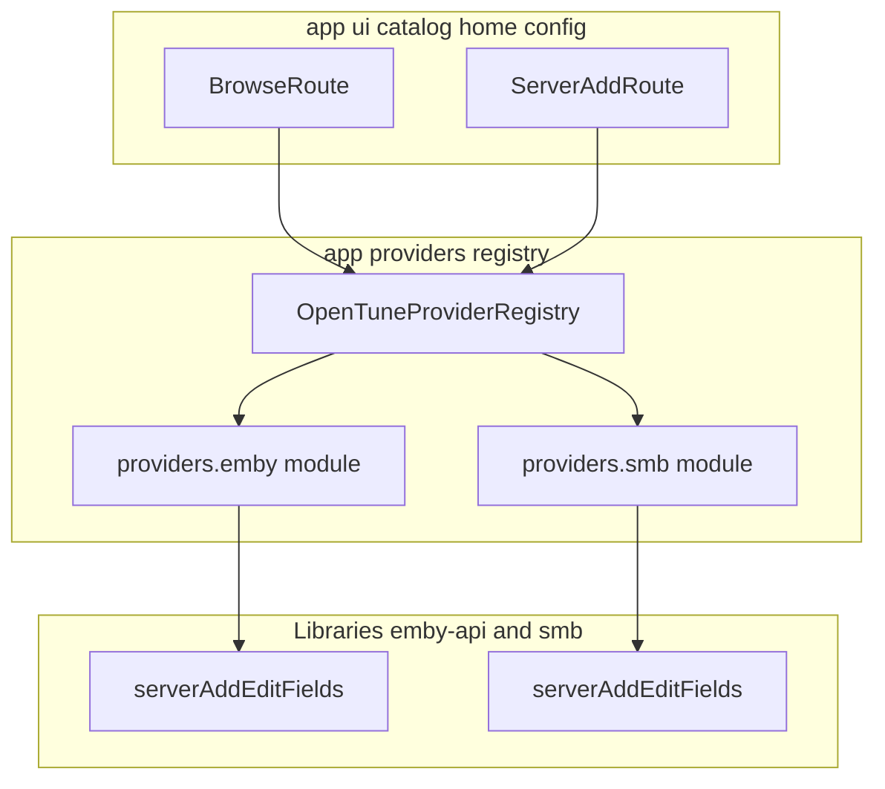

# Provider-agnostic UI (Phase B)

## Goal

- **Libraries** (`:emby-api`, `:smb`) expose **declarative add/edit field schemas** and remain the source of truth for “what fields exist.”
- **`:app`** exposes **one neutral catalog pipeline** and **one neutral playback entry** keyed by **`providerId: String`** (or a minimal sealed id if strictly typed), with **no** `Emby*` / `Smb*` symbols under **`ui/catalog`**, **`ui/home`**, or **navigation** composable sources except string route patterns if unavoidable.
- **Provider implementations** (HTTP client wiring, SMBJ sessions, Room DAO mapping) live under **`com.opentune.app.providers.*`** (or `app/.../providers/`), **not** under `ui/`.

## Workstream A — Server field schema

1. Define **`ServerFieldSpec`** (stable fields: `id`, `labelKey`, `fieldKind`, `required`, `sensitive`, `order`, optional `placeholderKey`, `validation`) in a small **shared** module **or** duplicated minimal DTO in each library if you want zero new Gradle module — pick one and document it in the PR.
2. **`emby-api`**: add **`fun serverAddEditFields(): List<ServerFieldSpec>`** (static list is enough for MVP).
3. **`smb`**: add the same API surface (parallel naming: `serverAddEditFields()`).
4. **`app`**: add **`strings.xml` / `plurals`** (or a single `ProviderStrings` map) mapping **`labelKey` → user-visible text** for TV; composables must not hardcode Emby/SMB copy in provider-specific branches.

## Workstream B — Neutral navigation

1. Add route constants and builders in [`Routes`](app/src/main/java/com/opentune/app/navigation/OpenTuneNavHost.kt) (or extracted `Routes.kt`): **`provider_add/{providerId}`**, **`provider_edit/{providerId}/{sourceId}`** (exact shape match existing id types: Long vs string — align with storage keys).
2. Update [`OpenTuneNavHost.kt`](app/src/main/java/com/opentune/app/navigation/OpenTuneNavHost.kt): register **one** `ServerAddRoute` and **one** `ServerEditRoute` composable for the new paths; remove composable entries that pointed at `EmbyAddRoute` / `SmbAddRoute` / edit variants once migrated.
3. Update [`HomeRoute`](app/src/main/java/com/opentune/app/ui/home/HomeRoute.kt) (and callers in NavHost): replace `onAddEmby` / `onAddSmb` with **`onAddProvider(providerId)`** (or two buttons calling the same lambda with different ids — **no** separate Emby/Smb callback types in the public `HomeRoute` API).

## Workstream C — Generic server add/edit UI

1. Implement **`ServerAddRoute(providerId, …)`** and **`ServerEditRoute(providerId, sourceId, …)`** under a neutral package (e.g. `com.opentune.app.ui.config` or `ui.server`).
2. On enter: resolve **`List<ServerFieldSpec>`** via **`ProviderFieldSchema.resolve(providerId)`** implemented in **`app/providers`** by delegating to `:emby-api` / `:smb` static functions (no UI imports from those packages inside composables — inject or call through a small **app-side** facade).
3. Persist: define **`ServerConfigPort`** (`suspend fun saveNew`, `suspend fun load`, `suspend fun update`) implemented per `providerId` in **`app/providers`** using existing DAOs / Emby flows.
4. Delete **`EmbyAddRoute`**, **`EmbyEditRoute`**, **`SmbAddRoute`**, **`SmbEditRoute`** once parity is reached.

## Workstream D — Provider registry (catalog + playback)

1. Add **`OpenTuneProviderRegistry`** (singleton from `Application` or Hilt/manual): maps **`providerId` → `CatalogBindingPlugin` + `PlaybackPlugin`** (names TBD).
2. **`CatalogBindingPlugin`**: `suspend fun browseBinding(...)`, `searchBinding(...)`, `detailBinding(...)` each returns **`CatalogResolveResult`** (reuse types from [`MediaCatalogBinding.kt`](app/src/main/java/com/opentune/app/ui/catalog/MediaCatalogBinding.kt) or move result types next to interface if cleaner).
3. **`PlaybackPlugin`**: expose whatever **`PlayerRoute`** needs (e.g. same contract as current [`PlaybackPreparer`](app/src/main/java/com/opentune/app/playback/PlaybackPreparer.kt) `Render`, or a non-Compose port + one Compose adapter).
4. **Registration**: in `OpenTuneApplication.onCreate`, register **`"emby"`** and **`"smb"`** entries wiring existing logic moved out of `ui/` into **`app/.../providers/emby`** / **`.../providers/smb`** packages.

## Workstream E — Catalog UI uses registry only

1. Replace [`CatalogProvider`](app/src/main/java/com/opentune/app/ui/catalog/CatalogProvider.kt) sealed dispatch to factories with **`providerId: String`** (or keep sealed **only** if it carries zero Emby/Smb names — prefer **string id** at nav boundary).
2. Implement **`resolveBrowseBinding` / `resolveSearchBinding` / `resolveDetailBinding`** as **`registry.catalog(providerId).…`** with **no** imports of provider implementation packages from **`ui/catalog`**.
3. Move subtitle / logTag policy: either **neutral rules** in catalog (derive from `location` shape) or return **`BrowseChrome`** from plugin — **no** `when (emby)` inside `BrowseRoute`.

## Workstream F — Playback uses registry only

1. Replace **`playbackPreparerFor(provider)`** when-chain with **`registry.playback(providerId).…`**.
2. Ensure [`PlayerRoute`](app/src/main/java/com/opentune/app/ui/catalog/PlayerRoute.kt) imports **only** registry façade + `PlaybackPreparer` interface, not provider packages.

## Workstream G — Relocate and delete old UI packages

1. Move adapter classes from **`ui/emby`** / **`ui/smb`** / **`ui/providers/emby`** (if Phase A landed) into **`app/.../providers/emby`** and **`.../providers/smb`** implementing registry interfaces.
2. Remove empty **`ui/emby`** / **`ui/smb`** directories.
3. Update **all** imports across `:app` modules.

## Workstream H — Documentation and verification

1. Update [`AGENTS.md`](AGENTS.md): neutral **`provider_add` / `provider_edit`**, forbid `Emby*` / `Smb*` under `ui/catalog` and `ui/home`, document **`app/providers`** layout.
2. Run **`./gradlew :app:compileDebugKotlin`** (and `:emby-api:compileKotlin` / `:smb` if changed).
3. Grep gates (must be clean or explicitly justified in one file):
   - `rg "Emby|Smb|emby|smb" app/src/main/java/com/opentune/app/ui/catalog`
   - `rg "Emby|Smb" app/src/main/java/com/opentune/app/ui/home`
   - `rg "ui\\.emby|ui\\.smb|providers\\.emby|providers\\.smb" app/src/main/java/com/opentune/app/navigation`

## Dependency diagram (target)

## Out of scope (separate plans)

- Jellyfin / Telegram / Baidu / NFS: add new **`CatalogBindingPlugin`** + schema + registration only; **do not** extend generic UI with new branches.
- Splitting **`app/providers`** into additional Gradle modules (`:providers-emby`) — optional later.
