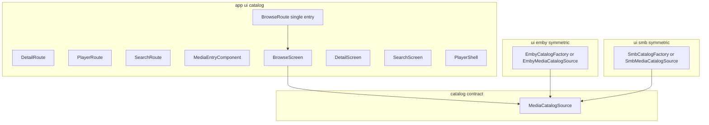

# Unified browse, detail, search, and player

## Symmetry vs asymmetry (what to enforce)

**Asymmetric** here means **inconsistent or ad hoc** layout between sources (and mixed concerns), not “code that cannot be unified.” Bad legacy examples to avoid:

- Emby: `ui/emby/browseRoute.kt` while player lived under `ui/player/playerRoute.kt`
- SMB: `ui/smb/SmbBrowseRoute.kt` and `ui/smb/SmbPlayerRoute.kt`
- Mixed casing, mixed `{Source}` prefix rules, or one source’s flow under a **generic** package when the other’s equivalent lives under **`ui/smb`** / **`ui/emby`**

**Symmetric** means **the same rule for Emby and SMB**: parallel package (`ui/emby` / `ui/smb`), parallel file/type names (same suffix pattern, e.g. `EmbyCatalogFactory` / `SmbCatalogFactory`), parallel route naming where routes are source-specific. **`emby_add` / `smb_add`** (and edit) are the **reference pattern** for that symmetry — not an “exception because unification is impossible,” but a **positive example** agents should extend to every source-specific concern (catalog binding, playback wiring, etc.).

Unified browse/detail/player/search routes are a **separate** goal: one route **family** with a `provider` segment so NavHost is not duplicated per protocol for those flows.

## Convention change (navigation)

After refactor, **do not use** separate per-protocol trees for catalog flows: `emby_browse/...`, `smb_browse/...`, `emby_detail/...`, `smb_player/...`, etc.

- **Unified routes** with a **provider** segment (`emby` | `smb`) and URL-encoded **location** / **item** (pick one scheme and use it consistently):
  - Browse: `browse/{provider}/{sourceId}/{location}`
  - Detail: `detail/{provider}/{sourceId}/{itemRef}`
  - Player: `player/{provider}/{sourceId}/{itemRef}/{startMs}` (SMB may ignore `startMs` or use `0` consistently)
  - Search: `search/{provider}/{sourceId}/{scopeLocation}` (scope = Emby parent or libraries token, SMB directory path)

**Source-prefixed routes** remain for **add/edit only**, as symmetric pairs: `emby_add`, `emby_edit/{serverId}`, `smb_add`, `smb_edit/{sourceId}` (plus matching `Routes` consts / builders).

**AGENTS.md** must document: (1) unified `browse` / `detail` / `player` / `search` patterns above, (2) symmetry rules in this section, (3) forbid generic `ui/player`-style packages **when only one source** uses them — if both sources need parallel player wiring files, put **`EmbyPlayer…` under `ui/emby`** and **`SmbPlayer…` under `ui/smb`**, with any truly shared shell in `ui/catalog` (or equivalent cross-source package).

## Symmetric implementations (Emby vs SMB)

Where behavior differs by source, **naming and placement stay parallel**:

| Concern | Emby | SMB |
|--------|------|-----|
| Catalog / browse API | `ui/emby/…` (e.g. `EmbyCatalogFactory` or `EmbyMediaCatalogSource`) | `ui/smb/…` (`SmbCatalogFactory` / `SmbMediaCatalogSource`) |
| Playback prep | Existing `EmbyPlaybackHooks`, Emby player wiring | Existing `SmbPlaybackHooks`, SMB player wiring |
| Low-level modules | `emby-api`, `EmbyRepository` | `smb`, `listDirectory`, placeholders in smb `res/` |

Shared Compose **only** calls **`MediaCatalogSource`** (or factories that produce it) and receives **provider** for logging — **no** Emby/SMB API calls inside grid/detail/search UI except through that contract.

Optional: mirror **file names** across packages (`EmbyCatalogFactory.kt` / `SmbCatalogFactory.kt`, `EmbyPlayerConfigurator.kt` / `SmbPlayerConfigurator.kt`) even if one file is thinner, so grep and code review stay symmetric.

## Current state (baseline)

- [OpenTuneNavHost.kt](app/src/main/java/com/opentune/app/navigation/OpenTuneNavHost.kt): separate composables for `EmbyLibrariesRoute`, `EmbyBrowseRoute`, `EmbyDetailRoute`, `EmbyPlayerRoute`, `SmbBrowseRoute`, `SmbPlayerRoute`; SMB plays video directly from browse with no detail screen.
- [EmbyBrowseRoute.kt](app/src/main/java/com/opentune/app/ui/emby/EmbyBrowseRoute.kt): `LazyColumn` of buttons; `EmbyRepository.getItems` / pagination; `CONTAINER_TYPES` for folder vs leaf.
- [EmbyLibrariesRoute.kt](app/src/main/java/com/opentune/app/ui/emby/EmbyLibrariesRoute.kt): `getViews()` — merged into browse via a **libraries location token** in unified browse.
- [SmbBrowseRoute.kt](app/src/main/java/com/opentune/app/ui/smb/SmbBrowseRoute.kt): column of buttons; `SmbListEntry` from [SmbConnection.kt](smb/src/main/java/com/opentune/smb/SmbConnection.kt).
- [EmbyApi.kt](emby-api/src/main/java/com/opentune/emby/api/EmbyApi.kt): extend for search-related query params; [EmbyImageUrls.kt](emby-api/src/main/java/com/opentune/emby/api/EmbyImageUrls.kt): add grid thumb helper.

## Architecture (layering)

- **Unified UI** under [`app/.../ui/catalog/`](app/src/main/java/com/opentune/app/ui/catalog/): screens and `MediaEntryComponent` — **cross-source**, not duplicate per provider.
- **Provider-specific** code only under [`ui/emby`](app/src/main/java/com/opentune/app/ui/emby/) and [`ui/smb`](app/src/main/java/com/opentune/app/ui/smb/) with mirrored naming.

## 1. `MediaEntryComponent`

- TV card: cover + title; Coil for HTTP covers; SMB/res drawables for folder vs file; Emby fallback when no Primary tag.
- Accessibility: `contentDescription`, folder vs file.

## 2. Browse: grid + D-pad

- **`TvLazyVerticalGrid`**, focus restorer, top bar: Back, Search.
- Activation: Emby folder → push same `browse` route with new `location`; Emby media → `detail`; SMB directory → `browse`; SMB file → `detail` then play from detail.

## 3. Detail + player on unified routes

- **`DetailScreen`** + **`PlayerShell`**; nav args carry `provider`, `sourceId`, encoded `itemRef`.
- Emby: keep resume, favorites, poster, overview (logic stays behind `MediaCatalogSource` impl on Emby side).
- SMB: default art, synopsis optional/minimal, Play only for video extensions.

## 4. Libraries merged into browse

- No separate libraries destination; first Emby browse location = reserved token interpreted as `getViews()` in **Emby** catalog impl only.

## 5. Search

- **`search/{provider}/{sourceId}/{scopeLocation}`**; `SearchScreen` + debounced query; Emby: API `SearchTerm` + recursive as needed; SMB: scoped directory filter (phase 1).

## 6. Logging

- Tags **`OpenTuneEmbyBrowse`** vs **`OpenTuneSmbBrowse`** (and Detail/Player/Search) from **provider** + screen — not a single shared tag for all providers.

## Implementation guardrails (anti-patterns, interface size, nav typing)

- **`MediaCatalogSource` must stay small.** Prefer a **few cohesive** suspend functions (or **split ports**: e.g. browse paging vs detail vs search) over one growing “god interface” that every new screen extends.
- **Typed domain at the Kotlin boundary, strings only for Nav.** Use a **sealed `CatalogProvider`** (or equivalent) plus **typed location / item refs** (Emby parent id vs libraries root vs SMB path). **Serialize to the route string in one place** (`Routes` / a dedicated parser); avoid scattering magic tokens like `__libraries__` without a named constant or sealed case.
- **Optional but valuable:** **ViewModels** per flow (`Browse`, `Detail`, `Search`) that receive a catalog implementation (or factory keyed by provider) so composables do not accumulate `LaunchedEffect` + state for every concern.
- **Emby search v1:** Pick **one** supported semantics (e.g. recursive under user root vs under current parent), document it, and tolerate server variance with clear errors — do not block the rest of the refactor on perfect global search.
- **SMB search v1:** **Current-directory name filter only** is enough; treat **recursive share search** as a later milestone so scope does not creep.
- **Playback:** Keep **`OpenTunePlayerScreen` + `OpenTunePlaybackHooks`** as the spine; symmetric helpers **`EmbyPlayerConfigurator` / `SmbPlayerConfigurator`** (or same idea, mirrored names) under `ui/emby` and `ui/smb` for ExoPlayer construction and hooks — shared **shell only** in `ui/catalog`, not merged incompatible setup in one class.
- **Lifecycle:** Make **ownership explicit** — who opens/closes **SMB `SmbSession`**, who owns **ExoPlayer** for each route, and how that lines up with `DisposableEffect` / `remember` when using unified `BrowseRoute` / `PlayerRoute`. Document in code at the factory or route entry point if non-obvious.
- **Debugging unified routes:** Add a **single parser** (and ideally **light tests**) for nav args ↔ typed `BrowseLocation` / `MediaRef` so malformed deep links fail loudly instead of failing deep in catalog code.

## Key files

| Area | Files |
|------|--------|
| Rules | [AGENTS.md](AGENTS.md) |
| Contracts + shared UI | `app/.../ui/catalog/` — models, `MediaCatalogSource`, `BrowseRoute` / screens, `MediaEntryComponent` |
| Symmetric impl | `app/.../ui/emby/*Catalog*.kt`, `app/.../ui/smb/*Catalog*.kt` (mirror names) |
| Emby API | [EmbyApi.kt](emby-api/src/main/java/com/opentune/emby/api/EmbyApi.kt), [EmbyRepository.kt](app/src/main/java/com/opentune/app/EmbyRepository.kt), [EmbyImageUrls.kt](emby-api/src/main/java/com/opentune/emby/api/EmbyImageUrls.kt) |
| SMB | [SmbConnection.kt](smb/src/main/java/com/opentune/smb/SmbConnection.kt) (+ filter helper, drawables) |
| Nav | [OpenTuneNavHost.kt](app/src/main/java/com/opentune/app/navigation/OpenTuneNavHost.kt), [HomeRoute.kt](app/src/main/java/com/opentune/app/ui/home/HomeRoute.kt) |
| Remove | [EmbyLibrariesRoute.kt](app/src/main/java/com/opentune/app/ui/emby/EmbyLibrariesRoute.kt); collapse old `EmbyBrowseRoute` / `SmbBrowseRoute` into catalog entry points or delete if nav only uses `BrowseRoute` |

## Risks / notes

- **Migration**: every `navigate(Routes.embyBrowse(...))` becomes `Routes.browse(Provider.Emby, ...)` (or equivalent).
- **Emby search**: server version quirks; handle errors in catalog impl.
- **SMB session**: lifecycle owned by SMB catalog impl / route `remember` aligned with unified `BrowseRoute`.
- **Pagination**: preserve Emby load-more in grid.
