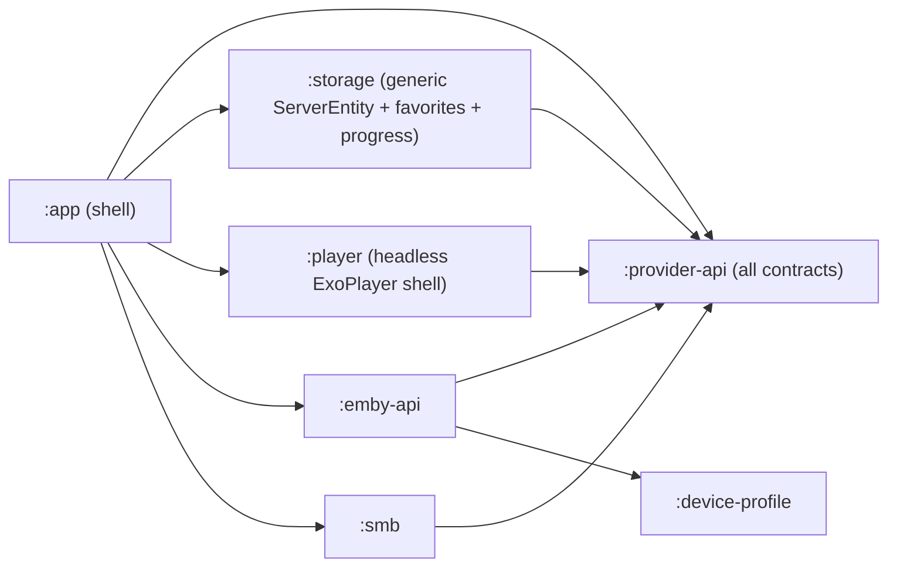

## Goal

`:app` contains zero `Emby*` or `Smb*` Kotlin identifiers and zero imports of `com.opentune.emby.api.*` / `com.opentune.smb.*`. All protocol logic lives in `:emby-api` and `:smb`. They communicate to `:app` via the contracts in `:provider-api`. Per [AGENTS.md](AGENTS.md), this is a draft refactor: no migrations, no compatibility shims — call sites update directly and the old code is deleted.

## Target dependency graph



`:playback-api` is deleted; its `OpenTunePlaybackHooks` moves into `:provider-api`.

## Phase 1 — Expand `:provider-api`, fold in `:playback-api`

Add new files in [provider-api/src/main/java/com/opentune/provider/](provider-api/src/main/java/com/opentune/provider/):

- `OpenTunePlaybackHooks.kt` — moved verbatim from `playback-api/.../OpenTunePlaybackHooks.kt`.
- `MediaModels.kt` — relocate `MediaListItem`, `MediaDetailModel`, image/poster types from [`app/.../ui/catalog/MediaModels.kt`](app/src/main/java/com/opentune/app/ui/catalog/MediaModels.kt).
- `MediaCatalogSource.kt` — interface relocated from [`app/.../ui/catalog/MediaCatalogSource.kt`](app/src/main/java/com/opentune/app/ui/catalog/MediaCatalogSource.kt).
- `CatalogBindingPlugin.kt` — interface relocated from [`app/.../providers/CatalogBindingPlugin.kt`](app/src/main/java/com/opentune/app/providers/CatalogBindingPlugin.kt).
- `PlaybackSpec.kt` — unified, protocol-agnostic playback contract. The provider returns a fully built Media3 `MediaSource` so neither `:player` nor `:app` ever branches on Emby vs SMB:

```kotlin
fun interface OpenTuneMediaSourceFactory {
    fun create(): androidx.media3.exoplayer.source.MediaSource
}

data class PlaybackSpec(
    val mediaSourceFactory: OpenTuneMediaSourceFactory,
    val displayTitle: String,
    val resumeKey: String,
    val durationMs: Long?,
    val audioFallbackOnly: Boolean,
    val hooks: OpenTunePlaybackHooks,
)
```

`:provider-api` therefore depends on `media3-exoplayer` (it already implicitly does via `:smb` / `:player`; this just makes it explicit on the contract module).

- `ProviderConfigBackend.kt` — `submitAdd(values, ServerStore): SubmitResult`, `submitEdit(...)`. `SubmitResult` carries success or a localized error message (no Retrofit types crossing modules).
- `ServerStore.kt` — neutral persistence: `upsert(providerId, sourceId, displayName, fieldsJson)`, `delete(...)`, `observeByProvider(providerId): Flow<List<ServerRecord>>`, `read(providerId, sourceId)`.
- `FavoritesStore.kt`, `ProgressStore.kt` — keyed by `(providerId, sourceId, itemRef)`.
- `OpenTuneProvider.kt` — umbrella registration carrying:
  - `providerId: String`
  - `addFields()` / `editFields()` `List<ServerFieldSpec>`
  - `catalogPlugin: CatalogBindingPlugin`
  - `resolvePlayback(sourceId, itemRef, startMs, deps): PlaybackSpec`
  - `configBackend: ProviderConfigBackend`
  - `bootstrap(Context)` (e.g. install client identification)
- `OpenTuneProviderIds.kt` — relocate constants from [`app/.../providers/OpenTuneProviderIds.kt`](app/src/main/java/com/opentune/app/providers/OpenTuneProviderIds.kt).

Then delete the `:playback-api` module: drop `include(":playback-api")` in [settings.gradle.kts](settings.gradle.kts) and remove its directory; replace `implementation(project(":playback-api"))` with `:provider-api` in [emby-api/build.gradle.kts](emby-api/build.gradle.kts), [smb/build.gradle.kts](smb/build.gradle.kts), [player/build.gradle.kts](player/build.gradle.kts), [app/build.gradle.kts](app/build.gradle.kts).

## Phase 2 — Generic `:storage`

In [storage/src/main/java/com/opentune/storage/](storage/src/main/java/com/opentune/storage/):

- Replace `EmbyServerEntity` and `SmbSourceEntity` with one `ServerEntity`:

```kotlin
@Entity(tableName = "servers", primaryKeys = ["providerId", "sourceId"])
data class ServerEntity(
    val providerId: String,
    val sourceId: String,
    val displayName: String,
    val fieldsJson: String,
    val createdAt: Long,
    val updatedAt: Long,
)
```

- Replace `EmbyServerDao` and `SmbSourceDao` with one `ServerDao`.
- Re-key `FavoriteEntity` and `PlaybackProgressEntity` to `(providerId, sourceId, itemRef)`.
- Update [`OpenTuneDatabase`](storage/src/main/java/com/opentune/storage/OpenTuneDatabase.kt) entities + version. No migrations (per AGENTS.md draft policy — destructive recreate).
- Add adapters in `:storage` that implement `ServerStore` / `FavoritesStore` / `ProgressStore` from `:provider-api` over the DAOs, exposed from a small `StorageBindings` factory.

## Phase 3 — Move Emby logic into `:emby-api`

Add to [emby-api/src/main/java/com/opentune/emby/api/](emby-api/src/main/java/com/opentune/emby/api/):

- `EmbyCredentials.kt` — `data class EmbyCredentials(baseUrl, userId, accessToken, displayName, deviceProfile)` parsed from `fieldsJson`.
- `EmbyRepository.kt` — moved from [`app/.../providers/emby/EmbyRepository.kt`](app/src/main/java/com/opentune/app/providers/emby/EmbyRepository.kt). Now constructs from `EmbyCredentials`; no `:storage` import.
- `EmbyCatalogBindingPlugin.kt` — replaces [`EmbyCatalogFactory`](app/src/main/java/com/opentune/app/providers/emby/EmbyCatalogFactory.kt). Implements `CatalogBindingPlugin` from `:provider-api`. Reads server fields via `ServerStore`, favorites via `FavoritesStore`, returns `MediaListItem` / `MediaDetailModel`.
- `EmbyPlaybackResolver.kt` — returns a `PlaybackSpec` whose `mediaSourceFactory` builds a `ProgressiveMediaSource` (or HLS source, when applicable) over an OkHttp `DataSource.Factory` carrying `X-Emby-Token` and any other Emby headers. Performs `getPlaybackInfo`, picks URL via `EmbyPlaybackUrlResolver`, wires `EmbyPlaybackHooks`. Adds `media3-datasource-okhttp` (or equivalent) to `:emby-api` so the module can construct its own `MediaSource`.
- `EmbyPlaybackHooks.kt` — moved from [`app/.../playback/EmbyPlaybackHooks.kt`](app/src/main/java/com/opentune/app/playback/EmbyPlaybackHooks.kt). Implements `OpenTunePlaybackHooks` (now from `:provider-api`). Receives `ProgressStore` and `EmbyRepository`.
- `EmbyConfigBackend.kt` — replaces the HTTP-library branches in [`ServerConfigRepository`](app/src/main/java/com/opentune/app/providers/ServerConfigRepository.kt). Calls `EmbyApi.authenticateByName`, formats errors via `formatHttpExceptionForDisplay` into `SubmitResult.Error`, persists via injected `ServerStore`.
- `EmbyProvider.kt` — umbrella `OpenTuneProvider` returning the above, with `bootstrap()` that installs `EmbyClientIdentificationStore`.

`:emby-api` does **not** add `:storage`; it depends only on `:provider-api` + `:device-profile` + Retrofit/OkHttp (already there).

## Phase 4 — Move SMB logic into `:smb`

Add to [smb/src/main/java/com/opentune/smb/](smb/src/main/java/com/opentune/smb/):

- `SmbCredentials` parser (from `fieldsJson`).
- `SmbCatalogBindingPlugin.kt` — replaces [`SmbCatalogFactory`](app/src/main/java/com/opentune/app/providers/smb/SmbCatalogFactory.kt). Lists directories via existing `SmbConnection.kt` helpers, maps to neutral `MediaListItem` / `MediaDetailModel`.
- `SmbPlaybackResolver.kt` — returns a `PlaybackSpec` whose `mediaSourceFactory` builds a `ProgressiveMediaSource` over [`SmbDataSource`](smb/src/main/java/com/opentune/smb/SmbDataSource.kt) using an opened `SmbSession` from [`SmbConnection.kt`](smb/src/main/java/com/opentune/smb/SmbConnection.kt). Sets `audioFallbackOnly` for video files where appropriate. Wires `SmbPlaybackHooks` (already in `:smb`).
- `SmbConfigBackend.kt` — neutral submit (validate fields, persist via `ServerStore`).
- `SmbProvider.kt` — umbrella registration.

## Phase 5 — Protocol-agnostic `:player` shell

[player/src/main/java/com/opentune/player/OpenTunePlayerScreen.kt](player/src/main/java/com/opentune/player/OpenTunePlayerScreen.kt) accepts a `PlaybackSpec` and:

- Calls `spec.mediaSourceFactory.create()` to obtain a Media3 `MediaSource`. **No URL parsing, no scheme branching, no OkHttp / SmbDataSource references in `:player`.**
- Sets that `MediaSource` on the existing `OpenTuneExoPlayer`.
- Drives `spec.hooks` for ready / progress / stop ticks (already abstracted via `OpenTunePlaybackHooks`).
- Uses `spec.audioFallbackOnly`, `spec.resumeKey`, `spec.durationMs`, `spec.displayTitle` for existing UI features (audio fallback banner, resume store, title).

The Compose shell stays in `:player`; `:app` only resolves the right provider, gets a `PlaybackSpec`, and invokes the shell. After this phase, `:player` has zero `Emby*` / `Smb*` symbols and zero imports of `:emby-api` / `:smb`.

## Phase 6 — Thin `:app`

In [app/src/main/java/com/opentune/app/](app/src/main/java/com/opentune/app/):

- [`OpenTuneApplication.kt`](app/src/main/java/com/opentune/app/OpenTuneApplication.kt): build `StorageBindings` from `:storage`, instantiate `EmbyProvider` and `SmbProvider`, call each `bootstrap(this)`, register them in a slimmed `OpenTuneProviderRegistry` that just maps `providerId -> OpenTuneProvider`. Remove all `com.opentune.emby.api.*` and `com.opentune.smb.*` imports.
- [`providers/OpenTuneProviderRegistry.kt`](app/src/main/java/com/opentune/app/providers/OpenTuneProviderRegistry.kt): now just `Map<String, OpenTuneProvider>`. No knowledge of Emby/SMB.
- [`providers/ProviderFieldSchema.kt`](app/src/main/java/com/opentune/app/providers/ProviderFieldSchema.kt): delete — `OpenTuneProvider.addFields()` replaces it.
- [`providers/ServerConfigRepository.kt`](app/src/main/java/com/opentune/app/providers/ServerConfigRepository.kt): becomes a small dispatcher to `provider(id).configBackend.submit*`.
- [`drafts/AddServerDraftStore.kt`](app/src/main/java/com/opentune/app/drafts/AddServerDraftStore.kt): replace `EmbyAddDraft` / `SmbAddDraft` with one `Map<String, String>` per `(providerId)` JSON blob.
- [`ui/config/ServerAddRoute.kt`](app/src/main/java/com/opentune/app/ui/config/ServerAddRoute.kt) / [`ServerEditRoute.kt`](app/src/main/java/com/opentune/app/ui/config/ServerEditRoute.kt): drop the `formatHttpExceptionForDisplay` import; render `SubmitResult.Error.message` from the provider. Submit-enable rule comes from `ServerFieldSpec.required`. Remove `OpenTuneProviderIds.HTTP_LIBRARY` branches (Emby-specific copy moves into `EmbyServerFields` placeholder/label keys).
- [`ui/home/HomeRoute.kt`](app/src/main/java/com/opentune/app/ui/home/HomeRoute.kt): observe `ServerStore.observeByProvider(id)` for each registered provider; remove direct `embyServerDao()` / `smbSourceDao()` use.
- [`ui/catalog/MediaCatalogBinding.kt`](app/src/main/java/com/opentune/app/ui/catalog/MediaCatalogBinding.kt): delegate via `app.providerRegistry.provider(id).catalogPlugin` (already does this through `CatalogBindingPlugin`, just with the interface now from `:provider-api`).
- [`ui/catalog/PlayerRoute.kt`](app/src/main/java/com/opentune/app/ui/catalog/PlayerRoute.kt): call `provider(id).resolvePlayback(...)` to get a `PlaybackSpec`, then hand it to `:player`.
- Delete: [`app/.../providers/emby/`](app/src/main/java/com/opentune/app/providers/emby/) directory, [`app/.../providers/smb/`](app/src/main/java/com/opentune/app/providers/smb/) directory, [`app/.../playback/EmbyPlaybackHooks.kt`](app/src/main/java/com/opentune/app/playback/EmbyPlaybackHooks.kt), [`app/.../playback/PlaybackPreparer.kt`](app/src/main/java/com/opentune/app/playback/PlaybackPreparer.kt) (replaced by headless contract).
- Move neutral catalog UI helpers ([`MediaEntryComponent.kt`](app/src/main/java/com/opentune/app/ui/catalog/MediaEntryComponent.kt), [`BrowseRoute.kt`](app/src/main/java/com/opentune/app/ui/catalog/BrowseRoute.kt), [`DetailRoute.kt`](app/src/main/java/com/opentune/app/ui/catalog/DetailRoute.kt), [`SearchRoute.kt`](app/src/main/java/com/opentune/app/ui/catalog/SearchRoute.kt), [`PlayerRoute.kt`](app/src/main/java/com/opentune/app/ui/catalog/PlayerRoute.kt), [`CatalogNav.kt`](app/src/main/java/com/opentune/app/ui/catalog/CatalogNav.kt)) stay in `:app` — they import only `:provider-api` types.

## Phase 7 — Docs and grep gates

- Rewrite [AGENTS.md](AGENTS.md) sections: contracts now under `:provider-api`; protocol code lives in `:emby-api` / `:smb`; `:storage` is provider-agnostic; `:playback-api` is gone.
- Grep gates that should return zero in `:app`:
  - `com.opentune.emby.api`
  - `com.opentune.smb\.`
  - `EmbyRepository`, `EmbyServerEntity`, `SmbServerEntity`, `SmbSourceEntity`, `SmbConnection`
- Grep gates that should return zero in `:player`:
  - `com.opentune.emby.api`, `com.opentune.smb\.`, `Emby`, `Smb`
  - `okhttp3` and `SmbDataSource` (provider-built `MediaSource` carries those internally)
- Grep gate in `:emby-api` and `:smb`: must not import `com.opentune.app.*` or `com.opentune.storage.*`.